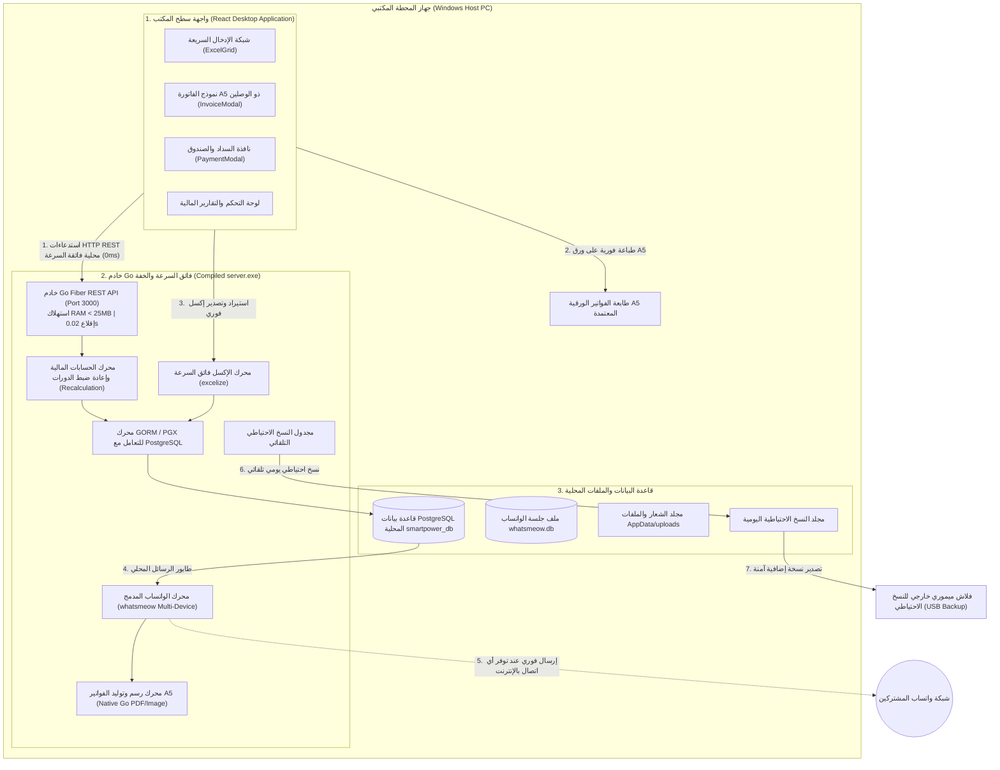

# الخطة الهندسية والتنفيذية الشاملة: التحول إلى باك إند Go فائق السرعة (Go Local Standalone ERP)

## 1. الملخص الفني للتحول المعماري
تحويل خادم العمليات من بيئة Node.js/Express إلى **خادم مجمّع فائق الخفة والسرعة بلغة Go (Golang)** يعمل كملف تنفيذي واحد (`server.exe`) متصل بقاعدة بيانات **PostgreSQL المحلية**، مع الحفاظ التام على واجهة **React Desktop** ونموذج الفاتورة **A5 ذو الوصلين**، ودمج محرك الواتساب الحديث **`whatsmeow`**، وحذف تطبيق الموبايل بالكامل.

---

## 2. شكل ومخطط النظام النهائي بعد التحول إلى Go

---

## 3. تفصيل ما سيتغير في النظام (Inventory of Changes)

### أولاً: خادم الباك إند (Node.js -> Go Migration)
1. **استبدال خادم Node.js**:
   - حذف مجلد `backend/` القديم (ومعه مئات الميجابايت من `node_modules`).
   - إنشاء مشروع Go متكامل في مجلد `server/` مبني على إطار العمل فائق السرعة **Go Fiber**.
2. **محرك قاعدة البيانات**:
   - استخدام `GORM` مع مشغل `pgx` للاتصال بـ PostgreSQL المحلية بكفاءة عالية وبدون وسيط Prisma.
3. **محرك الواتساب (`whatsmeow`)**:
   - استبدال مكتبة Baileys بمكتبة `whatsmeow` الأصلية في Go، وتخزين مفاتيح الجلسة في قاعدة بيانات محلية آمنة.
   - دعم كامل لعرض QR Code في الواجهة لإعادة الربط في ثوانٍ.
4. **محرك معالجة الإكسل (`excelize`)**:
   - قراءة وتصدير ملفات الإكسل الضخمة (حتى 50,000 صف) في أقل من ثانية واحدة باستهلاك ذاكرة لا يتجاوز 25MB.
5. **محرك توليد الفواتير A5 المدمج**:
   - توليد صور الفواتير وسندات القبض في الذاكرة مباشرة بدون الحاجة لمتصفح Chromium أو Puppeteer الثقيل.

### ثانياً: واجهة سطح المكتب (React Desktop)
1. **مطابقة عقد الـ API بنسبة 100%**:
   - خادم Go سيقدم نفس نقاط النهاية والمسارات والـ JSON responses التي تتوقعها واجهة React (`/api/customers`, `/api/readings`, `/api/payments`, `/api/invoices`, `/api/settings`, `/api/whatsapp`).
   - هذا يضمن أن واجهة React ستعمل فوراً دون أي تعديلات معقدة.
2. **تثبيت نموذج الفاتورة A5 ذو الوصلين**:
   - الحفاظ على كود وتصميم `InvoiceModal.tsx` و `InvoicePreviewModal.tsx` المعتمد الحالي المطابق لـ `photo_5769554780358381104_y.jpg`.
   - فرض الترقيم المركب `INV-[Cycle]-[SubscriberNumber]` في حقل رقم الفاتورة.
   - فرض الأرقام الإنجليزية (0, 1, 2, 3...) بنسبة 100%.

### ثالثاً: قاعدة البيانات المحلية (Local PostgreSQL)
- إنشاء قاعدة بيانات `smartpower_db` على جهاز الويندوز.
- إنشاء الجداول ومطابقتها عبر سكريبتات Go GORM AutoMigrate:
  `customers`, `meter_readings`, `invoices`, `payments`, `payment_allocations`, `customer_credits`, `system_settings`, `users`, `audit_logs`, `whatsapp_queue_messages`, `import_jobs`.

### رابعاً: الحذف والتنظيف (Deprecations)
- **حذف تطبيق الموبايل بالكامل**: حذف مجلد `mobile_app/` وملفات الـ APK (`SmartPowerCollector_v2.apk`).
- **حذف مجلدات Node.js للباك إند**: حذف `backend/node_modules` واستبدالها بالملف المجمّع `server.exe`.

---

## 4. الخطة التنفيذية الميدانية خطوة بخطوة (Phased Roadmap)

### المرحلة 1: بناء هيكل مشروع Go وقاعدة البيانات (يوم 1)
1. تهيئة مشروع Go في مجلد `server/` وتثبيت الحزم: `github.com/gofiber/fiber/v2`, `gorm.io/gorm`, `gorm.io/driver/postgres`, `github.com/xuri/excelize/v2`, `go.mau.fi/whatsmeow`.
2. تعريف نماذج البيانات (Go Structs) ومطابقتها مع قاعدة بيانات PostgreSQL المحلية.
3. برمجة وتفعيل خوارزمية الحسابات المالية:
   - حساب الاستهلاك وتطبيق التعرفة والرسوم والمتأخرات.
   - التوزيع المائي لسندات السداد (FIFO Waterfall).
   - إعادة الحساب التتابعي للدورات السابقة واللاحقة (Recalculation).

### المرحلة 2: برمجة مسارات الـ REST API في Go (يوم 1 - يوم 2)
1. برمجة مسارات المشتركين (`/api/customers`) مع الفلاتر والبحث وتعديل الخلايا اللحظي.
2. برمجة مسارات القراءات والدورات الشهرية (`/api/readings`).
3. برمجة مسارات التحصيل والصندوق والسندات (`/api/payments`).
4. برمجة مسارات الإعدادات، المستخدمين، وسجلات التدقيق (`/api/settings`, `/api/users`, `/api/audit-logs`).
5. برمجة مسارات استيراد وتصدير ملفات الإكسل عبر `excelize`.

### المرحلة 3: محرك الواتساب وتصوير الفواتير (يوم 2)
1. بناء خدمة `whatsmeow` وإدارة الاتصال بجلسة الواتساب وعرض QR Code عبر نقطة نهاية الـ API.
2. بناء محرك توليد الفواتير وسندات القبض كصور عالية الدقة لإرسالها بالواتساب.
3. ربط طابور الرسائل `whatsapp_queue_messages` ومجدول النسخ الاحتياطي التلقائي اليومي.

### المرحلة 4: الربط بواجهة React وتجميع الملف التنفيذي والتنظيف (يوم 3)
1. ربط واجهة React Desktop بالباك إند Go والتحقق من سلاسة التنقل وسرعة شبكة `ExcelGrid`.
2. تجميع خادم Go بالكامل في ملف تنفيذي خفيف `server.exe`.
3. حذف مجلد `mobile_app/` وحزم الـ APK والباك إند القديم.
4. إجراء فحص تشغيلي شامل لكافة وظائف المنظومة.
