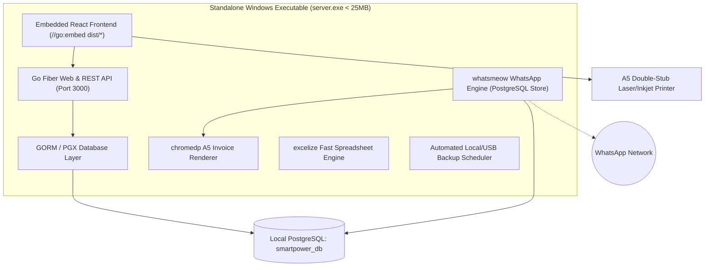

# MASTER MIGRATION PLAN
## Project: SmartPower Electricity Utility ERP Migration to Standalone Go Architecture

---

## A. System Understanding

### 1. Current Architecture Overview
The current system is a hybrid electricity billing and station management application composed of:
- **Frontend**: React 18, TypeScript, Tailwind CSS, Vite, TanStack React Query, Axios.
- **Legacy Monolithic Backend**: Node.js, Express, Prisma ORM, `@whiskeysockets/baileys` (WhatsApp), `puppeteer` (Invoice rendering), `xlsx` / `exceljs` (Spreadsheet processing).
- **Database**: PostgreSQL (currently configured via Prisma to Supabase or local PostgreSQL).
- **Mobile Application**: Flutter / Dart application located in `mobile_app/` (targeted for complete deprecation).

### 2. Directory Structure
```
d:/elctercity/
├── backend/                  # Monolithic Node.js backend (to be retired)
│   ├── prisma/schema.prisma  # Full Prisma schema
│   ├── src/
│   │   ├── controllers/      # Customer, Reading, Payment, Invoice, Import, Export, WhatsApp, Analytics
│   │   ├── services/         # Recalculation, WhatsApp, Invoice-Renderer, Excel-Async-Import, Backup
│   │   ├── routes/           # 14 Express routes
│   │   └── lib/              # Prisma client, phone formatting, tafqeet
├── frontend/                 # React 18 Desktop / Web UI
│   ├── src/
│   │   ├── components/       # ExcelGrid, InvoiceModal (A5 double-stub), PaymentModal, StationLogo
│   │   ├── pages/            # Customers, TodayReadingsReview, Invoices, ArrearsReport, Dashboard
│   │   └── lib/api.ts        # Axios API client
├── mobile_app/               # Obsolete Flutter app (to be deleted)
├── MIGRATION/                # 3-File Migration Control Protocol
│   ├── MASTER_PLAN.md
│   ├── EXECUTION_LOG.md
│   └── FINAL_AUDIT.md
└── package.json / dist
```

### 3. Critical Data & API Flows
1. **Meter Readings & Invoicing**:
   - `POST /api/readings`: Accepts `customer_id`, `reading_value`, `collector_name`, `client_mutation_id`.
   - Validates reading non-monotonicity ($\text{Reading} \ge \text{Previous Reading}$).
   - Computes consumption: $\max(0, \text{reading\_value} - \text{previous\_reading})$.
   - Calculates energy cost: $\text{consumption} \times \text{kwh\_price}$.
   - Adds fixed tariff fee and previous arrears to establish `total_due`.
   - Auto-deducts existing customer credits (`customer_credits`).
   - Generates and stores `Invoice` record linked to `MeterReading`.
2. **Payments & Cashiering**:
   - `POST /api/payments`: Accepts `customer_id`, `amount_paid`, `payment_method`, `accountant_name`.
   - Generates sequential receipt number.
   - Executes FIFO waterfall allocation across pending unpaid invoices (`Unpaid`, `Partially_Paid`).
   - Creates `PaymentAllocation` records.
   - If overpaid, allocates remainder to `customer_credits` (`status = 'AVAILABLE'`).
3. **A5 Double-Stub Invoice Rendering**:
   - Renders HTML/CSS template matching `photo_5769554780358381104_y.jpg` (Right = Collector Coupon, Left = Main Invoice).
   - Generates high-res image/PDF using `chromedp` (Edge/Chrome) for WhatsApp and native print for physical A5 laser/inkjet printer.
4. **WhatsApp Dispatching**:
   - Reads pending jobs from `whatsapp_queue_messages`.
   - Dispatches via `whatsmeow` with rate-limiter (8-15s throttle) to prevent bans.

---

## B. Business Logic Inventory

| Operation | Inputs | Validations | Calculation / Core Logic | Database Effects | Concurrency Guard |
| :--- | :--- | :--- | :--- | :--- | :--- |
| **Submit Reading** | `customer_id`, `reading_value`, `collector_name`, `client_mutation_id` | `reading_value >= previous_reading`, positive amount, customer exists | $\text{Cons} = R - R_{prev}$, $\text{Cost} = \text{Cons} \times P_{kwh}$, $\text{Due} = \text{Cost} + \text{Fee} + \text{Arrears} - \text{Credit}$ | Inserts `meter_readings`, inserts `invoices`, updates `customer_credits`, logs `audit_logs` | `client_mutation_id` UUID uniqueness + `FOR UPDATE` row lock on customer |
| **Submit Payment** | `customer_id`, `amount_paid`, `payment_method`, `accountant_name` | `amount_paid > 0`, customer exists | Sequential receipt generation, FIFO waterfall allocation across overdue invoices, surplus to credits | Inserts `payments`, inserts `payment_allocations`, updates `invoices` (status & remaining), inserts `customer_credits` | `FOR UPDATE` lock on customer and pending invoices in single atomic TX |
| **Cycle Recalculation** | `invoice_id`, `new_reading`, `new_price`, `new_fee` | Invoice exists, reading $\ge$ previous | Recalculates modified invoice, cascades delta forward across all subsequent billing cycles for the customer | Updates affected `invoices`, recalibrates customer balance and arrears | Atomic multi-cycle transaction with customer lock |
| **Approve Reading** | `reading_id` | Status is `PENDING` | Sets `approval_status = 'APPROVED'`, applies available credits, queues WhatsApp message | Updates `meter_readings`, updates `invoices`, inserts `whatsapp_queue_messages` | Idempotent status check |
| **Excel Ingest** | Spreadsheet Buffer | Required columns present, valid subscriber numbers | Batch verification, creates new customers or updates readings in chunks | Inserts `import_jobs`, inserts `import_staging_rows`, bulk upserts `customers` | File SHA-256 hash deduplication |

---

## C. Target Architecture



### Architectural Guarantees:
1. **Resource Efficiency**: RAM usage $< 30\text{MB}$, startup time $< 0.05\text{s}$, zero `node_modules` in backend.
2. **Pure Static Binary**: Compiled with `CGO_ENABLED=0`, zero external DLL or MinGW dependencies.
3. **Database Integrity**: 100% of financial data, settings, and WhatsApp session stores unified inside local PostgreSQL (`smartpower_db`).
4. **Offline Autonomy**: 100% functional without internet; WhatsApp automatically syncs and drains queue when network connects.
5. **English Numerals Discipline**: 100% English digits (0, 1, 2, 3...) across all layers.

---

## D. Phased Migration Strategy

### Phase 1: Discovery, Baseline & Environment Preparation
- Audit database schema, relationships, and seed data.
- Ensure local PostgreSQL service is running on port 5432.
- Establish `MIGRATION/MASTER_PLAN.md` and `MIGRATION/EXECUTION_LOG.md`.
- **Phase Gate**: PASS when baseline audit is documented and verified.

### Phase 2: Local Database Schema & Financial Core Migration
- Create `smartpower_db` on local PostgreSQL.
- Write explicit SQL DDL migrations with strict `CHECK` constraints, foreign keys, and indexes.
- Port stored procedures and financial transaction logic.
- **Phase Gate**: PASS when schema compiles, migrations execute, and test queries pass.

### Phase 3: High-Performance Go Backend Engine
- Initialize Go module in `server/`.
- Implement GORM/pgx models and database connection pool.
- Implement REST API routes matching 100% of the Express API contracts (`/api/customers`, `/api/readings`, `/api/payments`, `/api/invoices`, `/api/settings`, `/api/analytics`, `/api/import`, `/api/export`).
- Implement cycle recalculation service in Go.
- Implement `excelize` async spreadsheet processor.
- **Phase Gate**: PASS when all endpoints return identical JSON schema and tests pass.

### Phase 4: whatsmeow WhatsApp Engine & chromedp A5 Invoicing
- Implement `whatsmeow` using native PostgreSQL `sqlstore` (`CGO_ENABLED=0`).
- Implement rate-limited WhatsApp background queue worker (8-15s throttle).
- Implement `chromedp` A5 double-stub invoice snapshot engine.
- Implement automated local daily database backup scheduler.
- **Phase Gate**: PASS when QR pairing endpoint works, A5 rendering outputs clean Arabic ligatures, and backup dumps execute.

### Phase 5: React Frontend Integration & Embedding (`//go:embed`)
- Build React frontend (`npm run build`).
- Embed `frontend/dist` directly into Go binary using `//go:embed`.
- Configure SPA fallback routing and auto-browser launch on Windows.
- Compile standalone `server.exe`.
- **Phase Gate**: PASS when `server.exe` launches, serves UI, and operates with 0 external dependencies.

### Phase 6: Obsolete Code Deprecation & Deep Cleanup
- Verify zero runtime references to `mobile_app/`.
- Safely remove `mobile_app/` directory and `.apk` files.
- Retire old Node.js backend files.
- Re-run full build and verification test suite.
- **Phase Gate**: PASS when project builds cleanly with 0 dead code warnings.

### Phase 7: Final Independent Audit & Decision
- Comprehensive audit across Architecture, Data, Security, Reliability, and Operations.
- Generate `MIGRATION/FINAL_AUDIT.md`.
- Issue strict verdict: `READY` or `NOT_READY`.
